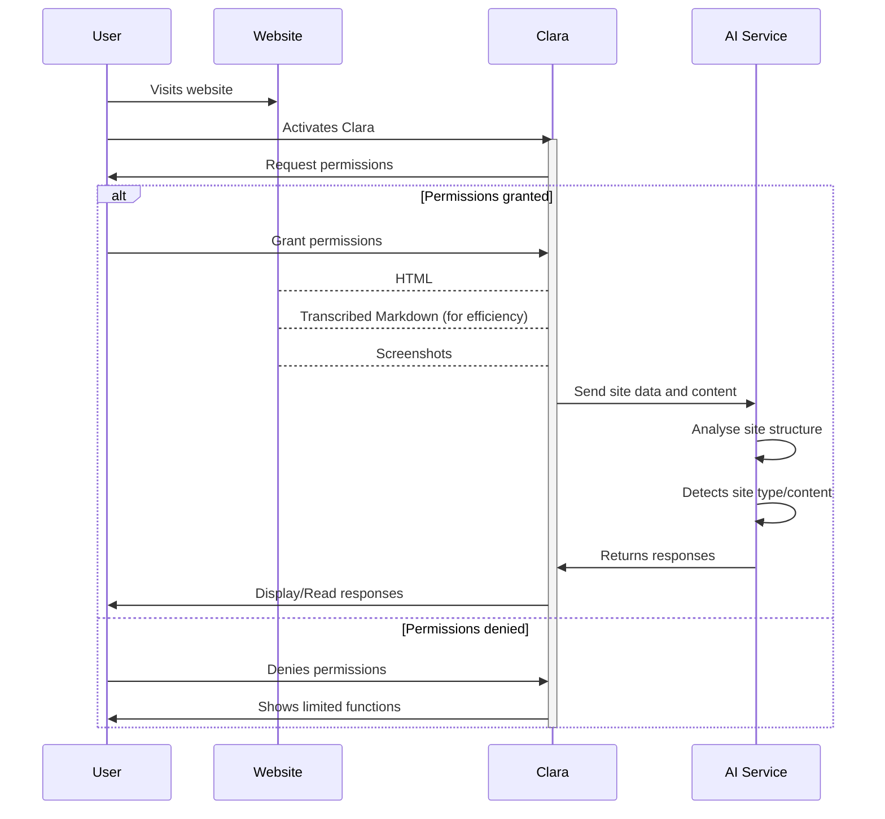

# Clara

Clara aims to extend the capabilities of screen readers with the help of LLM.

## Plan

### Components

- Chrome Extension (frontend)
    - Browser screen capture: using `chrome.tabCapture` or `chrome.desktopCapture` to capture a video stream of the
      active webpage tab.

## Workflow

